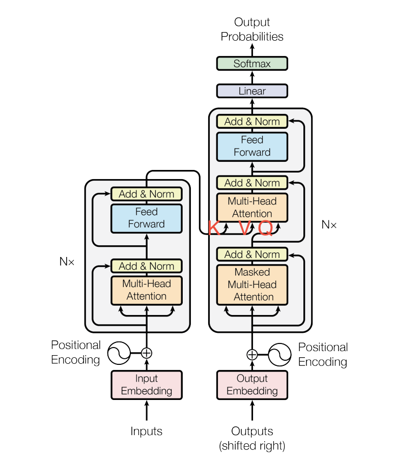

本系列用于介绍transformer的基本架构及其衍生的变种，尽量简明清晰讲清楚原理和实现方式，如有问题和补充，多谢各位批评指正。
# Transformer
2017年Google的[attention is all you need](https://arxiv.org/abs/1706.03762)中提出的
multi-head attention(多头注意力机制)是目前主流llm的基础。

本文的创新点有：
1. multi-head attention
2. sinusoidal position embedding
3. batch norm -> layer norm
## 为什么除以根号d
## 为什么需要位置编码

# Attention

## [Multi-head attention](./attention/mha.py)
## [Multi-query attention](./attention/mqa.py)
## [Group Query attetion](./attention/gqa.py)
> [GQA](https://arxiv.org/pdf/2305.13245)